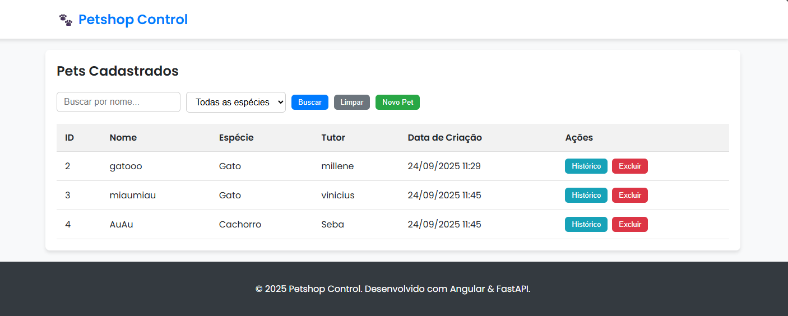
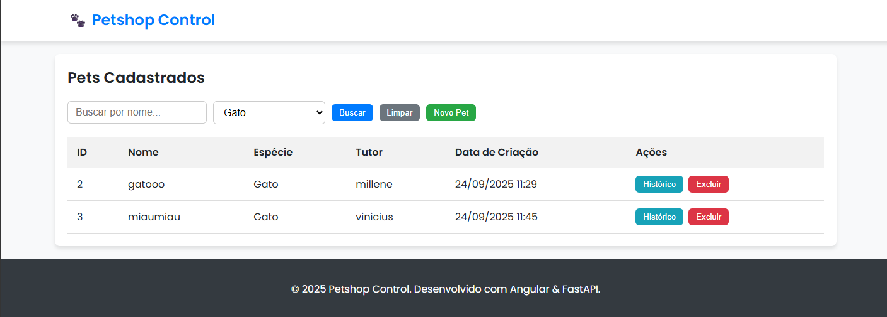
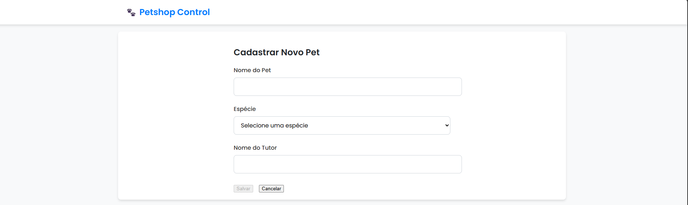
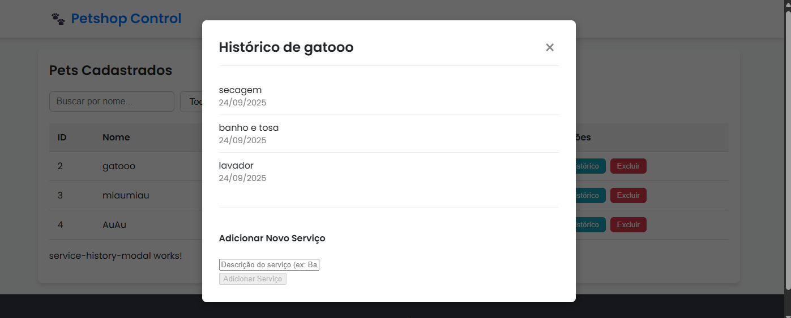

# Controle de Petshop com FastAPI e Angular

Projeto full-stack desenvolvido como parte da avaliação técnica para a vaga de Estágio em Desenvolvimento de Software. A aplicação permite o gerenciamento de pets e serviços de um petshop, com um backend em Python (FastAPI) e um frontend em Angular.

---

## ✨ Funcionalidades

- **Gestão de Pets:**
  - Cadastrar, listar, buscar (por nome) e filtrar (por espécie) pets.
  - Remover pets com um pop-up de confirmação.
- **Gestão de Serviços:**
  - Adicionar novos serviços (banho, tosa, etc.) a um pet específico.
  - Visualizar o histórico dos últimos 5 serviços de cada pet em um modal.
- **Backend Robusto:** API RESTful construída com FastAPI, conectada a um banco de dados PostgreSQL.
- **Frontend Moderno:** Interface reativa e responsiva construída com Angular.

---

## 🛠️ Tecnologias Utilizadas

- **Backend:**
  - Python 3
  - FastAPI
  - SQLAlchemy (ORM)
  - Psycopg2
  - Uvicorn (Servidor ASGI)
- **Frontend:**
  - Angular
  - TypeScript
  - CSS3
- **Banco de Dados:**
  - PostgreSQL
- **Ferramentas:**
  - Git & GitHub
  - pgAdmin 4
  - Visual Studio Code

---

## 🚀 Como Executar a Aplicação

Siga os passos abaixo para configurar o ambiente e rodar o projeto.

### **Pré-requisitos**

- [Node.js e npm](https://nodejs.org/en/)
- [Python 3](https://www.python.org/downloads/)
- [PostgreSQL](https://www.postgresql.org/download/) e pgAdmin

### **1. Configuração do Banco de Dados**
1.  Abra o **pgAdmin**.
2.  Crie um novo banco de dados com o nome `petshop_db`.
3.  Abra a **Query Tool** para o `petshop_db`.
4.  Copie o conteúdo do arquivo `db/create_tables.sql` e execute-o para criar as tabelas `pets` e `servicos` e popular com dados iniciais.

### **2. Configuração do Backend (Terminal 1)**
1.  Clone este repositório.
2.  Navegue até a pasta do backend e configure o ambiente virtual:
    ```bash
    cd backend-python
    python -m venv venv
    source venv/Scripts/activate
    ```
3.  Instale as dependências:
    ```bash
    pip install -r requirements.txt
    ```
4.  Inicie o servidor da API:
    ```bash
    uvicorn main:app --reload
    ```
    > O backend estará rodando em `http://localhost:8000`. Deixe este terminal aberto.

### **3. Configuração do Frontend (Terminal 2)**
1.  Abra um **novo terminal**.
2.  Navegue até a pasta do frontend:
    ```bash
    cd frontend-angular
    ```
3.  Instale as dependências:
    ```bash
    npm install
    ```
4.  Inicie a aplicação Angular:
    ```bash
    ng serve --open
    ```
    > A aplicação será aberta no seu navegador em `http://localhost:4200`.

---

## 📸 Capturas de Tela

### 1. Página Principal
*Visão geral da aplicação, com a lista de pets cadastrados.*


### 2. Filtros em Ação
*Demonstração da funcionalidade de busca por nome e filtro por espécie.*



### 3. Cadastro de Pet
*Formulário para adicionar um novo pet ao sistema.*


### 4. Histórico de Serviços
*Modal exibindo os serviços recentes de um pet e o formulário para adicionar um novo serviço.*
